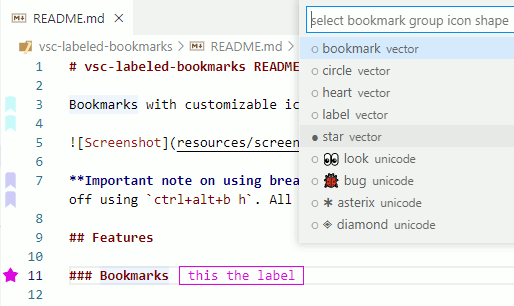
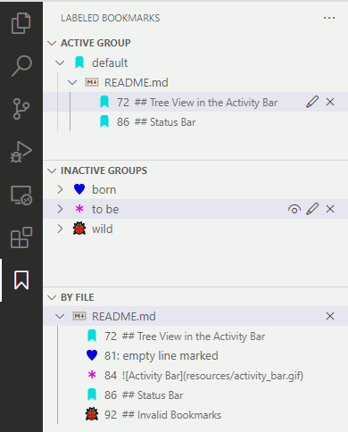

# vsc-labeled-bookmarks README

Bookmarks with customizable icons, colors and other visuals, organized into groups between which you can switch, keyboard shortcut for most functions.

**Important note on using breakpoints:**  Line decorations (in general) seem to interfere with placing breakpoints for debugging. To work around this, you can toggle the decorations on and off using `ctrl+alt+b h`. All operations still work the same when the decorations are hidden.

## Features

### Bookmarks

* You can set an unnamed bookmark on a line using `ctrl+alt+m`. If there already is a bookmark on the line, it is removed. If you have a multi line selection, the first line will be bookmarked. If you have multiple selections or multiple cursors, each receives the action.
* Labeled bookmarks can be set using `ctrl+alt+l`. A prompt appears where you can type the label for the bookmark. If you have some text selected, that will be the default value of the input box. **You can have multiple bookmarks with the same label, but if you use a single character as the label, that label will be kept unique (VIM style relocating the bookmark instead of adding another one.)** This action does not work on multiple cursors, only on (the first) one.
* The labeled bookmark creation is multi functional: it expects the input in the format of "bookmark label" or "bookmark label@@group name" or just "@@group name. When a group name is specified, the group is created if it does not yet exist and it is set to be the active group. Then, if the label is specified, a new bookmark is created using it.
* Delete bookmarks using `ctrl+alt+b d`, or by using the above toggle commands on a line that already has a bookmark (of the active group).

### Navigation

* Go to the next bookmark: `ctrl+alt+k`
* Go to the previous bookmark: `ctrl+alt+j`
* Navigate to a bookmark by selecting it from a list: `ctrl+alt+n` A quick pick list appears where the bookmarks are filtered as you type. All bookmarks are displayed in the list, including the unnamed ones.
* Navigate to a bookmark of any group (same as `ctrl+alt+n` but not limited to the active group): `ctrl+alt+b n`

### Expand Selection

* You can expand the current selection to the next bookmark by using `shift+alt+k`
* To expand the selection to the previous bookmark, use `shift+alt+j`

Both operations work in a double tap fashion: the selection is expanded first up to but not including the bookmarked line, and on a second use it is expanded to include that line as well.

### Groups

Most operations work on the currently active group's bookmarks. Each group has its own icon shape/color, but the inactive group icons appear semi transparent (or are hidden when `ctrl+alt+b i` is toggled).

Groups were implemented to be able to separate one set of bookmarks (for one topic/bug/branch etc.) from others. You can work with the set that is currently relevant, without other bookmarks littering the forward/backward navigation and without having to delete them to avoid this.

* You can create a group and switch to it implicitly by using the "@@" when creating a labeled bookmark with `ctrl+alt+l`. See the relevant section above for details.
* Alternatively, you can create a group using `ctrl+alt+b alt+g`
* Delete one or multiple groups using `ctrl+alt+b shift+g`
* Select the active group from a list of the available groups: `ctrl+alt+b g`
* Move bookmarks from the active group to another one using `ctrl+alt+b m`

### Display Options

* Hide / unhide bookmark icons (might be necessary to set a breakpoint on a line that also has a bookmark): `ctrl+alt+b h`
* Hide / unhide the icons of inactive groups: `ctrl+alt+b i`
* Setting to control the appearance of overview ruler (scrollbar) decorations
* Setting to control how the label text for labeled bookmarks should appear at the line's end

### Customizing Group Icons

Group icons come in two variants: vector icons (fixed set) and unicode character icons (customizable set).

* Vector icons provide a fixed set of shapes to chose from, and they should appear the same across all devices. When a new group is created it uses the shape specified as the default shape in the configuration options. If your group has a single character name, and it matches `[a-zA-Z0-9!?+-=\/\$%#]`, then the uppercased character is displayed on the icon.
* Unicode character icons can be customized using the `labeledBookmarks.unicodeMarkers` configuration option. You can define which unicode characters/symbol/emojis you would like to use as the group icon. These can be applied using the shape selection command `ctrl+alt+b s`. If none is defined, a default set is used. (Emojis have their own color and so the color setting remains ineffective on those, but it works as expected on the rest of the unicode alphabets and symbols.)

The other display option for group icons is the color.

* The icon color can be chosen selected from a list using `ctrl+alt+b c`. You can define the elements of this list with the configuration option `labeledBookmarks.colors`. If it is not defined a default color set is used.

## Extension Settings

* `labeledBookmarks.unicodeMarkers`: list of unicode characters to be made available in the shape selection list. It should be in the form of: `[["look", "👀"], ["bug","🐞"]]`
* `labeledBookmarks.colors`: list of colors to be made available when creating new bookmark groups or when setting the color of an existing one. It should be in the form of: `[["red", "ff0000"], ["green", "00ff00"]]`
* `labeledBookmarks.defaultShape`: set which vector icon should be used as the default for new groups
* `labeledBookmarks.overviewRulerLane`: set how the bookmark should be marked on the overview ruler (scrollbar)
* `labeledBookmarks.lineEndLabelType`: set how the line end labels for labeled bookmarks should be displayed

## Tree View in the Activity Bar

There are two views of the bookmarks available in the activity bar under the bookmark icon: one grouping them by files and another grouping them by bookmark group and then by files.
In both there are action buttons to activate groups, rename items and to delete items.

You can directly access this by using `ctrl+alt+b t`. If a text document is active at the time of using this shortcut and it has bookmarks, the nearest bookmark is highlighted in the tree view. (This might not always work, as described under 'Known Issues')

## Status Bar

The current active group and the number of bookmarks within it are displayed in the status bar.

## Invalid Bookmarks

This extension tries to follow file rename and delete actions initiated from within VSCode.

* Upon rename, the bookmark is assigned to the new file name.
* Upon delete, bookmarks belonging to the file are deleted.

If a bookmark becomes invalid because of other kind of file changes (the file or the line it points to becomes unavailable), then the next time you try (and fail) to navigate to it, it gets flagged as having failed the jump. This is signaled with a warning icon in the navigation list. Such flagged bookmarks are skipped the next time. By repeatedly using the navigate to next/previous bookmark action, you can have all broken bookmarks marked as failing, and then the navigation works on the rest of the bookmarks normally.

You can remove this broken bookmark flags:

* by successfully navigating to them using `ctrl+alt+n` or `ctrl+alt+b n`
* or by clearing all the flags using `ctrl+alt+b f`

Or you can delete them using `ctrl+alt+b d` and selecting them manually.

## Known Issues

* Bookmark icons might interfere with placing breakpoints. Use `ctrl+alt+b h` to hide/unhide the bookmark icons to avoid this.
* On Mac the backward navigation shortcut `ctrl+alt+j` is also used by the notebook editor command "join with next cell" with the activation condition "notebookEditorFocused". If you happen to be using that, you might want to change the assignment of either of these conflicting  actions. If you are not using notebooks, there should be no problem.
* The content of the bookmarked line is stored within the bookmark itself for display purposes, and it is updated when changes in the file/line trigger a file changed event. However, not all changes to files trigger such an event. Git operations and even source code formatters might cause file changes without triggering a proper update of the bookmarks, and so markings can drift off the originally marked code and the stored line text might get off sync from the actual line content.
* If a bookmark becomes invalid because the file got truncated by an outside action, and it now points to a not existing line, the bookmark's icon will float around at the end of the file. I don't want to go overboard with file system watching and what not, so if you see a suspiciously placed bookmark icon, try navigating to the next bookmark. If it is in fact invalid, it will get marked as such, and it will be easy to identify and delete it using `ctrl+alt+b d`.
* Showing the closest bookmark in the tree view using `ctrl+alt+b t` sometimes fails to do its job properly. This is caused by the fact that tree views' inner state is not updated when they are invisible. Unfortunately, focusing on the closest bookmark would require that the tree view already knows about the current state of the bookmarks, even before it is visible. If the tree becomes visible, but does not jump to the closest bookmark, repeating the command should work as intended.

## If You Find Bugs

Raise an issue on GitHub if you find something, but make sure to also provide information on how to reliably reproduce it.
